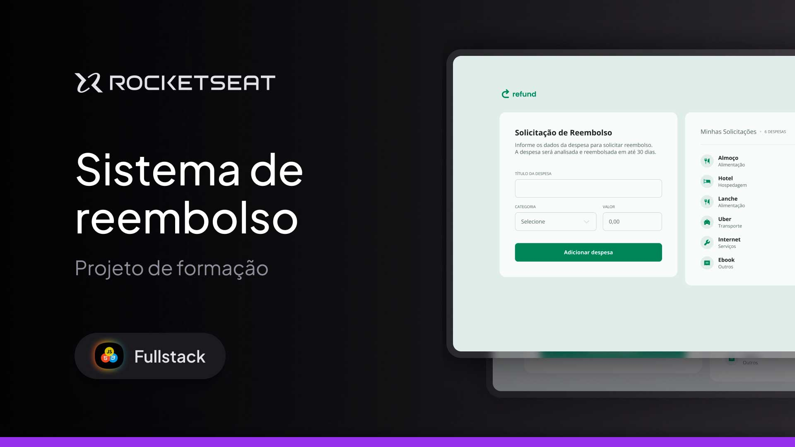

<h1 align="center">💸 Refund App</h1>

Expense reimbursement system developed as part of the Rocketseat Fullstack formation — this project is part of the JavaScript specialization module.

  <a href="#-about-the-project">About</a>&nbsp;&nbsp;&nbsp;|&nbsp;&nbsp;&nbsp;
  <a href="#-technologies">Technologies</a>&nbsp;&nbsp;&nbsp;|&nbsp;&nbsp;&nbsp;
  <a href="#-layout">Layout</a>&nbsp;&nbsp;&nbsp;|&nbsp;&nbsp;&nbsp;
  <a href="#memo-license">License</a>

  

 

  

---

## 🚀 About the Project

Refund is a simple web application that allows users to submit reimbursement requests and keep track of their expenses.

This project was built to practice JavaScript concepts such as DOM manipulation, form handling, data validation, and local storage. It also introduces the basics of dynamic interfaces by rendering lists and managing user inputs.

The main goal was to simulate a real-world workflow for expense tracking, reinforcing my understanding of front-end logic with JavaScript.

In future iterations, I intend to improve the UI, add data persistence with a backend service, and implement features like filtering and editing expenses.

---

## 🛠 Technologies

This project was developed using:

- HTML
- CSS
- JavaScript
- DOM Manipulation
- Git & GitHub
- Figma
- Responsiveness techniques

---

## 🔗 Live Project

➡️ [Access the live version](https://andreskull2.github.io/refund/)  
🎓 [Watch the classes](https://www.rocketseat.com.br/formacao/fullstack)

---

## 🎨 Layout

You can check out the original layout here:

🔗 [View on Figma](https://www.figma.com/community/file/1360316109107378379) *(requires a Figma account)*

---

## :memo: License

This project is licensed under the **MIT License**.  
Feel free to use it as a reference or learning material — just remember to give credit where it’s due.

---

Made with ♥ by Rocketseat — Rebuilt with care by @andreskull2 🚀  
:wave: [Join our community!](https://discord.gg/rocketseat)
